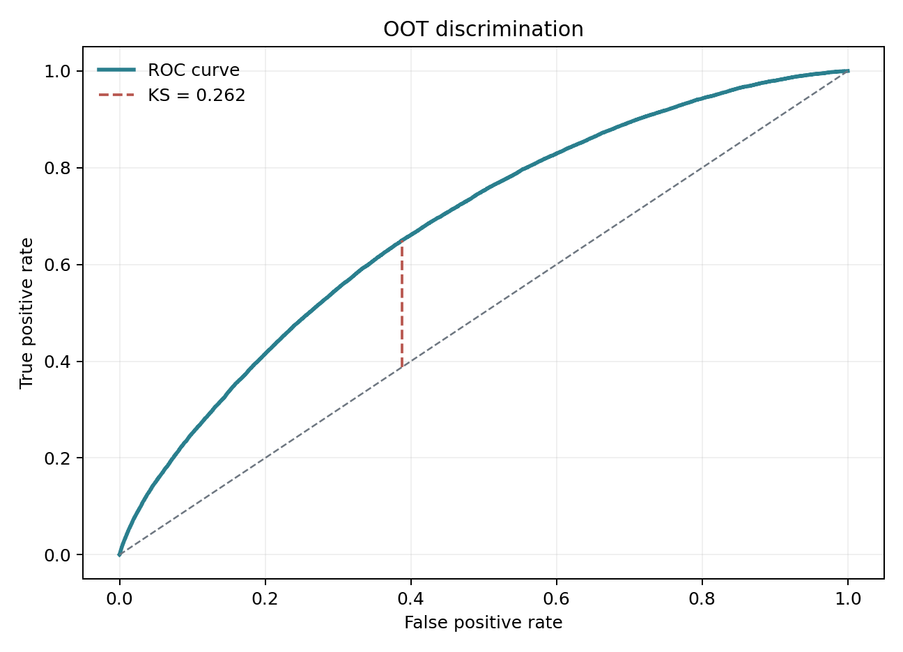
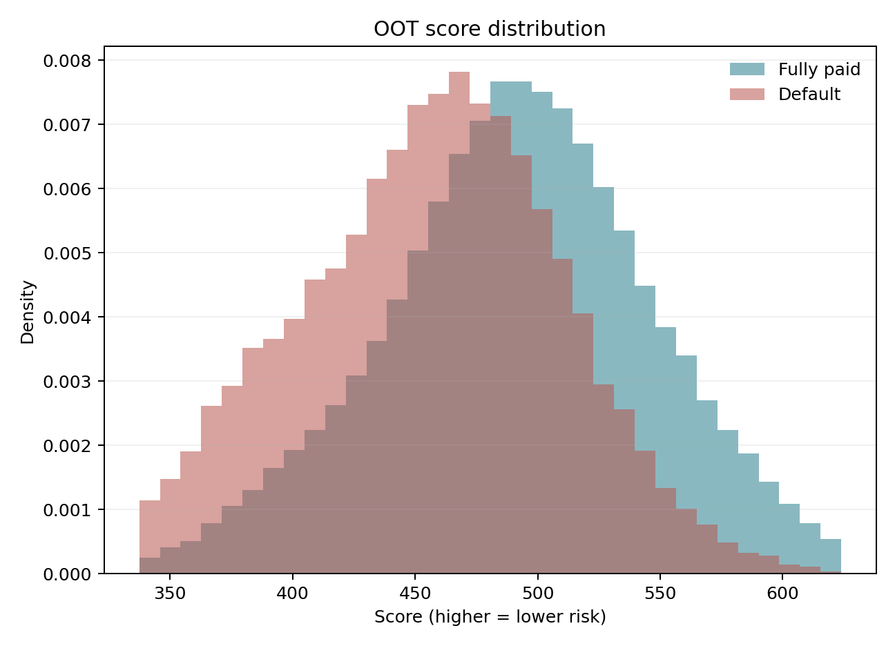

# LendingClub 贷前申请信用评分卡

一套面向风险策略与量化建模岗位的、可复现的申请评分卡项目。它不把“WOE + Logistic”当作终点，而是完整处理数据泄露、时间切分、右删失、PD 校准、评分映射、稳定性监控和策略阈值边界。

## 结果摘要

| 样本 | 时间 | 样本量 | AUC | KS | 实际坏账率 | 平均预测 PD |
|---|---|---:|---:|---:|---:|---:|
| Development | 2014–2015 | 598,649 | 0.713 | 30.9% | 19.54% | 24.83% |
| Validation | 2016 | 293,105 | 0.693 | 27.5% | 23.29% | 23.29% |
| OOT | 2017 | 169,321 | **0.681** | **26.2%** | 23.13% | **22.72%** |

- Development → OOT Score PSI：**0.023**（稳定）
- OOT 最高 / 最低风险十分位坏账率：**45.2% / 6.1%**
- 评分参数：Base Score 600、Base Odds 20:1、PDO 50
- 原始数据约 226 万条；最终状态表现样本约 134.5 万条



## 为什么这不是一份标准课堂作业

- **只使用申请时点信息。** `grade`、`sub_grade`、`int_rate` 是 LendingClub 既有风控决策的输出，全部排除；还排除了放款和贷后表现字段。
- **按时间而非随机切分。** 2014–2015 开发、2016 验证、2017 OOT；2007–2013 只做历史诊断。
- **识别标签右删失。** 2018 年越晚月份的已观察坏账率越低，不把尚未走完表现期的贷款误当“好客户”。
- **校准风险水平。** 使用 2016 验证集做 intercept-only calibration；不改变排序、系数相对作用、AUC 或 KS。
- **同时监控总分与变量。** 输出 Score PSI 和 Feature PSI，避免总分稳定掩盖底层字段漂移。
- **不夸大策略结果。** 通过率—坏账率表是历史已放款客群内部情景，不冒充拒绝客户的真实审批效果。

## 建模流程

1. 状态与标签治理：仅保留 `Fully Paid / Charged Off / Default`；Current、Late、In Grace Period 不强制贴标签。
2. 数据清洗：字段类型、异常值、重复记录、训练期 0.5%/99.5% 缩尾。
3. 特征工程：`loan_to_income`、`credit_history_months`，连续变量单调 WOE 分箱，类别低频合并。
4. 特征筛选：IV 0.02–0.50、WOE 相关性上限 0.70、最多 15 个变量。
5. Logistic Regression：验证集选择 L2 正则强度，并进行只移动截距的 PD 校准。
6. 评分映射：600 分、Good:Bad=20:1、PDO=50；分数越高，风险越低。
7. OOT 评估：AUC、KS、Brier、Log Loss、十分位 Lift、Score/Feature PSI。
8. 策略分析：不同目标通过率下的分数 cutoff、观察坏账率和违约覆盖。



## 快速复现

需要 Python 3.10+。原始 CSV 约 1.6 GB，不提交到仓库；下载脚本会校验 MD5。

```bash
python -m venv .venv
source .venv/bin/activate  # Windows: .venv\Scripts\activate
pip install -r requirements.txt

python scripts/download_data.py
python scripts/train_scorecard.py
```

运行测试：

```bash
PYTHONPATH=src python -m unittest discover -s tests -v
```

主要产物：

- `artifacts/binning_table.csv`：分箱、WOE、坏账率与 IV
- `artifacts/scorecard_points.csv`：变量分箱对应分值
- `artifacts/metrics.json`：AUC、KS、Brier、Log Loss、校准与评分参数
- `artifacts/feature_psi.csv`：单变量稳定性监控
- `artifacts/approval_strategy_scenarios.csv`：通过率—坏账率阈值情景
- `reports/model_development_report.md`：模型开发报告

## 项目结构

```text
├── configs/model_config.json
├── scripts/
│   ├── download_data.py
│   ├── train_scorecard.py
│   └── build_report_docx.py
├── src/credit_scorecard/
│   ├── data.py
│   ├── binning.py
│   ├── modeling.py
│   ├── scoring.py
│   ├── metrics.py
│   ├── reporting.py
│   └── pipeline.py
├── tests/test_scorecard.py
├── artifacts/                 # 可审计的文本结果；模型二进制不提交
└── reports/
```

## 关键边界

该数据只有 LendingClub 历史已放款客户的真实表现，因此模型刻画的是 approved-book 内部风险排序，不能直接外推到被拒申请人。Rejected Loans 没有真实违约标签，把“被拒”视为“违约”会制造伪标签。生产化还需要 reject inference 假设验证、欺诈标签、LGD/EAD、资金与运营成本、公平性测试、模型审批和监控回滚机制。

公开的美国 P2P 贷款样本也不能被表述为可直接部署于中国数字银行；本项目证明的是完整、透明、可审计的风险建模工作流。

## 数据来源

- [Kaggle — All Lending Club loan data](https://www.kaggle.com/datasets/wordsforthewise/lending-club)
- [DePaul University 公共镜像与 LendingClub 数据字典](https://bigblue.depaul.edu/jlee141/econdata/LendingClub_LoanData/)
- [UCM / Zenodo — Lending Club loan dataset for granting models](https://doi.org/10.5281/zenodo.11295916)，用于交叉核对申请时点变量与泄露风险

代码采用 MIT License；数据权利与引用要求遵循原始数据发布页面。

